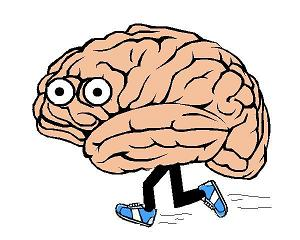
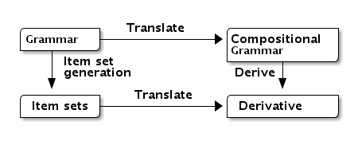

% LR parsing is the derivative of context free grammars
% Josef Svenningsson
%

# LR parsing is the derivative of context free grammars

The title says it all.

But you might not be convinced by me just saying so..

# Jogging your brains

# Context Free Grammars

A context free grammar

$\begin{array}{lcl}
E & \rightarrow & E * B\\
E & \rightarrow & E + B\\
E & \rightarrow & B\\
B & \rightarrow & 0\\
B & \rightarrow & 1\\
\end{array}$

# Formal Definition

A Context Free Grammar is a four-tuple:

* A set of terminals $T$
* A set of nonterminals $NT$
* A start symbol $S \in NT$
* A set of productions. Each production consist of:
    * A nonterminal; the head
    * The symbol $\rightarrow$
    * A body consisting of a sequence of terminals and nonterminals

# Semantics of a grammar

The semantics of a grammar is defined in terms of derivation trees.

\begin{verbatim}
         E               E
         |               |
        /|\             /|\
       E * E           E + E
      /     \         /     \
     /|\     0       0     /|\
    0 + 1                 1 * 0
\end{verbatim}

If a string has more than one derivation the grammar is ambiguous.

# LR parsing

* The most common algorithm for parsing formal languages.
* Invented by Knuth
* Lots of tools for generating LR parsers: YACC, Bison, Happy, ...

# LR parser machine

# Producing the LR automaton

Going from a grammar to an LR automaton goes via item sets. 

$\begin{array}{lcl}
\multicolumn{3}{l}{\text{Item Set 0}}\\
E & \rightarrow & \bullet E * B\\
E & \rightarrow & \bullet E + B\\
E & \rightarrow & \bullet B\\
E & \rightarrow & \bullet 0\\
E & \rightarrow & \bullet 1\\
\\
\multicolumn{3}{l}{\text{Item Set 1}}\\
B & \rightarrow & 0 \bullet\\
\\
\multicolumn{3}{l}{\text{Item Set 2}}\\
B & \rightarrow & 1 \bullet\\
\\
\multicolumn{3}{l}{\text{Item Set 3}}\\
E & \rightarrow & E \bullet * B\\
E & \rightarrow & E \bullet + B\\
\end{array}$

Advancing the dot one step is like recognizing one character in the input.

# Item set

Each item set corresponds to a state in the LR automaton (for LR(0) parsers).

# Item sets are the derivative of the context free grammar

My claim:

Item sets are the derivative of the context free grammar

# A new representation of Context Free Grammars

It's not exactly clear from the presentation of item sets that they 
correspond to some kind of derivative

To demonstrate this we need a new representation of context free grammars

# A new syntax for syntax

$\begin{array}{lcl}
G,H \in \text{Grammar} & ::= & x \: | \: 0 \: | \: 1 \: | \: G \cdot  H \: | \: G \: + \: H \: | \: T \: A\\
T \in \text{Grammar Tuples} & ::= & r \: | \: \mu r . \{ A \mapsto G \}_{A \in N}
\end{array}$

# An example grammar

$\begin{array}{lll}
\mu r . \{ & E \mapsto (r E \: \text{'+'} \: r B) + 
    (r E \: \text{'*'} \: r B) + r B ; \\
&    B \mapsto 0 + 1 & \}_{\{E, B\}}
\end{array}$

$\begin{array}{lcl}
E & \rightarrow & E * B\\
E & \rightarrow & E + B\\
E & \rightarrow & B\\
B & \rightarrow & 0\\
B & \rightarrow & 1\\
\end{array}$

# Semantics

The current semantics I have is unfortunately not based on derivation trees.

It only captures whether a grammar recognizes a language or not. There is
no notion of ambiguity.

$0, 1, + \: \text{and} \: *$ form a semi-group

# The Derivative

$\begin{array}{lcl}
\partial_x x            & = & 1 \\
\partial_x (y\not= x)   & = & 0 \\
\partial_x 0            & = & 0 \\
\partial_x 1            & = & 0 \\
\partial_x (G \cdot H)  & = & \partial_x G \cdot H + \delta G \cdot \partial_x H \\
\partial_x (G + H)      & = & \partial_x G + \partial_x H \\
\partial_x (r A)        & = & 0 \\
\partial_x ((\mu r . \{ A \mapsto G_A\}_{A \in N}) B)  & = & 
	   \mu r . \{ S \mapsto \partial_x G_B \}_{\{S\}\cup N} S
\end{array}$

$\begin{array}{lcl}
\delta_\varsigma x           & = & 0\\
\delta_\varsigma 0           & = & 1\\
\delta_\varsigma 1           & = & 0\\
\delta_\varsigma (G \cdot H) & = & \delta_\varsigma G \cdot \delta_\varsigma H\\
\delta_\varsigma (G + H)     & = & \delta_\varsigma G + \delta_\varsigma H\\
\delta_\varsigma (T A)       & = & (\delta_\varsigma T) A\\
\\
\delta_\varsigma (r A) & = & 0\\
\delta_\varsigma (\mu r . {A \mapsto H} A) & = & \delta_\varsigma\\
\end{array}$

$\begin{array}{lcl}
\partial_A x           & = & 0\\
\partial_A 0           & = & 0\\
\partial_A 1           & = & 0\\
\partial_A (G \cdot H) & = & \partial_A G \cdot H + \delta G \cdot \partial_A H\\
\partial_A (G + H)     & = & \partial_A G + \partial_A H\\
\partial_A (r A)       & = & 1\\
\partial_A (r B\not= A) & = & 0\\
\partial_A (\mu r . \{A \mapsto G_A\}_N B) & = & 
\end{array}$

# Translation

# The Proof

# Derivatives

The intuition behind derivatives in computer science: removing one item

* Data types: making one hole
* Regular expressions: recognizing one character
* LR parsing: recognizing one character

# Questions

